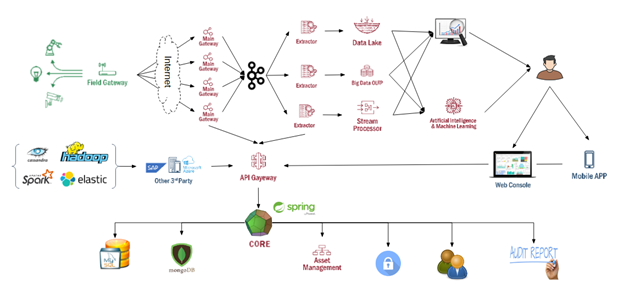
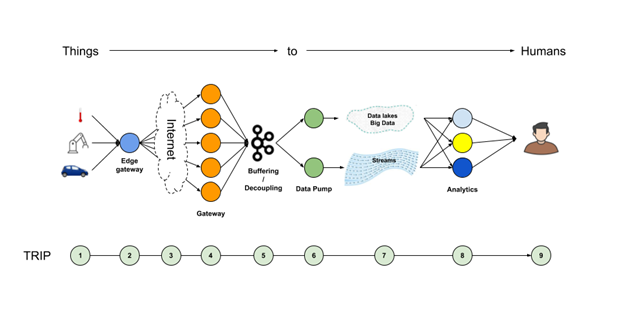

### Architecture

>>>>>  gd2md-html alert:  ERRORs: 0; WARNINGs: 0; ALERTS: 3.

<ul style="color: red; font-weight: bold"><li>See top comment block for details on ERRORs and WARNINGs. <li>In the converted Markdown or HTML, search for inline alerts that start with >>>>>  gd2md-html alert:  for specific instances that need correction.</ul>

Links to alert messages:
<a href="#gdcalert1">alert1</a>
<a href="#gdcalert2">alert2</a>
<a href="#gdcalert3">alert3</a>

>>>>> PLEASE check and correct alert issues and delete this message and the inline alerts.

# **Overview of the GV IoT platform: trip of a single measurement**

To simplify the exposition of the GV IoT platform, in terms of what it is and how it addresses some of the top IoT issues (amount of data to elaborate, security, scalability, storage and analytics), we will describe the trip of a single measurement from **Things to Humans **and the back trip of a command from **Humans to Things**.

To make the narration of the trip more intuitive and concrete we will use a single use case described by the reference scenario below.

Since the narration will be done on a specific scenario, we don't pretend to cover every single aspect of the IoT, or to cover all possibilities we have to solve all obstacles, but we strongly believe that the general understanding of the platform will be a lot better. Anyway on some situation we will refer to the other two scenarios.

During the trip we will often zoom in and out from details to high level architecture, to better under the the capabilities of the GV IoT platform.

Moreover, along the narration we will focus on these aspects of the GV IoT platform:

*   Security aspects
*   Traffic and scalability of the platform
*   The 3M = Modularity, maintainability, monitorability 

We will also describe what choices we do have at each step. For example:

*   Are the sensors directly connected to the internet or do we need a dedicated 4G communication?
*   On the EdgeGateway if we have to transfer to the Gateway 100 GB per day, what protocol it is better to use
    *   MQTT
    *   json/http
    *   Kafka 2 Kafka communication
    *   Raw socket communication
*   Do we have to send all the data or only an aggregate value?
*   What about filtering and buffering?

### High level architecture

The architecture of the platform will be described in a specific chapter, but for now it is useful to keep it at hand while we explain some aspects of the platform.

>>>>>  gd2md-html alert: inline image link here (to images/architecture0.png). Store image on your image server and adjust path/filename if necessary.  (<a href="#">Back to top</a>)(<a href="#gdcalert2">Next alert</a>) >>>>> 

### Overview of the trip from Things to Humans: sensed data and analytics

>>>>>  gd2md-html alert: inline image link here (to images/architecture1.png). Store image on your image server and adjust path/filename if necessary.  (<a href="#">Back to top</a>)(<a href="#gdcalert3">Next alert</a>) >>>>> 

We will describe all the steps that a single measure will do from **Things to Humans**:

1. **Starting point - the Things**

        We will describe how a sensor detects a measure (ex. the temperature of a room at a "T" time), how the measurement is read (raw value) on the sensor and pre-formatted into a digital value (ex. by the firmware and HW on the sensor)

2. EdgeGateway: sends the data through the internet to the Gateway

        We don't want to spoil :-) Read the chapter that tells the whole story

3. Internet: The data crosses the internet
4. Enter the Gateway
5. Buffering / decoupling (store the raw data into an intermediate storage)
6. DataPump from the buffer to the data lake
7. DataLake & Streaming
8. Analytics
9. **End point: the Humans**

### Overview of the trip from Humans to Things: configure, administer, act on actuators

>>>>>  gd2md-html alert: inline image link here (to images/architecture2.png). Store image on your image server and adjust path/filename if necessary.  (<a href="#">Back to top</a>)(<a href="#gdcalert4">Next alert</a>) >>>>> 

We will describe all the steps a single measure will do from **Humans to Things**:

1. **Starting point - the Humans**

        We will describe what a person can do to act on a Thing: open a door, turn on the heat, turn off lights, etc.

2. The console

        We don't want to spoil :-) Read the chapter that tells the whole story

3. The core
4. Dispatch commands
5. The Gateway receive the command
6. Internet: The command crosses the internet
7. The EdgeGateway receive the command
8. **End point: the Things**

<!-- Docs to Markdown version 1.0β16 -->

